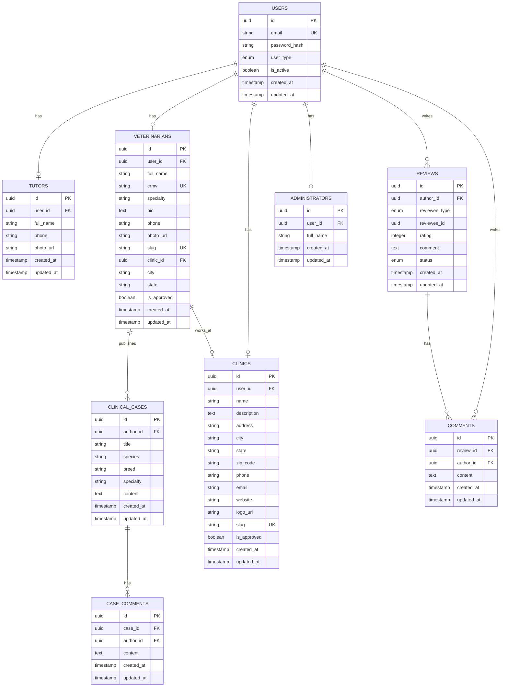

# ERD - Entity Relationship Diagram

## VetLândia - Banco de Dados MVP Funcional

## Tabelas e Relacionamentos

### 1. **users** (Autenticação Base)
- PK: `id` (UUID)
- UK: `email`
- Enum: `user_type` (tutor, veterinarian, clinic, admin)
- Índices: `email`

### 2. **tutors** (Donos de Pets)
- PK: `id`
- FK: `user_id` → users(id)
- Relacionamento: 1:1 com users

### 3. **veterinarians** (Profissionais)
- PK: `id`
- FK: `user_id` → users(id)
- FK: `clinic_id` → clinics(id) [opcional]
- UK: `crmv`, `slug`
- **Campo moderação:** `is_approved` (default: False)
- Índices: `crmv`, `slug`, `city`, `state`, `is_approved`
- Relacionamento: 1:1 com users, N:1 com clinics

### 4. **clinics** (Estabelecimentos)
- PK: `id`
- FK: `user_id` → users(id)
- UK: `slug`
- **Campo moderação:** `is_approved` (default: False)
- Índices: `slug`, `city`, `state`, `is_approved`
- Relacionamento: 1:1 com users, 1:N com veterinarians

### 5. **administrators** (Moderadores)
- PK: `id`
- FK: `user_id` → users(id)
- Relacionamento: 1:1 com users

### 6. **reviews** (Avaliações)
- PK: `id`
- FK: `author_id` → users(id)
- Polimórfico: `reviewee_type` + `reviewee_id`
- **Campo moderação:** `status` (pending, approved, rejected)
- Constraints:
  - `rating` entre 1 e 5
  - `comment` mínimo 50 caracteres
  - UK: `(author_id, reviewee_type, reviewee_id)` - 1 review por usuário
- Índices: `author_id`, `reviewee_id`, `created_at`, `status`

### 7. **comments** (Comentários em Reviews)
- PK: `id`
- FK: `review_id` → reviews(id) [CASCADE DELETE]
- FK: `author_id` → users(id)
- Constraints:
  - `content` mínimo 10 caracteres
- Índices: `review_id`, `author_id`, `created_at`

### 8. **clinical_cases** (Casos Clínicos)
- PK: `id`
- FK: `author_id` → veterinarians(id)
- Índices: `author_id`, `specialty`, `created_at`

### 9. **case_comments** (Comentários em Casos)
- PK: `id`
- FK: `case_id` → clinical_cases(id) [CASCADE DELETE]
- FK: `author_id` → veterinarians(id)
- Índices: `case_id`, `author_id`, `created_at`

---

## Enums

### UserType
- `tutor`
- `veterinarian`
- `clinic`
- `admin`

### RevieweeType
- `veterinarian`
- `clinic`

### ReviewStatus
- `pending` ← **Padrão para novas reviews**
- `approved` ← **Visível publicamente**
- `rejected` ← **Não exibido**

---

## Índices Estratégicos

### Performance de Busca:
- `veterinarians.city`, `veterinarians.state`
- `veterinarians.crmv`, `veterinarians.slug`
- `clinics.city`, `clinics.state`, `clinics.slug`

### Performance de Moderação:
- `veterinarians.is_approved`
- `clinics.is_approved`
- `reviews.status`

### Performance de Listagem:
- `reviews.created_at`
- `clinical_cases.created_at`
- `comments.created_at`

---

## Regras de Negócio Implementadas

### Moderação:
1. **Veterinários e Clínicas** começam com `is_approved = False`
2. **Reviews** começam com `status = pending`
3. **Admin** aprova/rejeita via painel

### Constraints:
1. **Review:** 1 por usuário por profissional/clínica
2. **Rating:** Entre 1 e 5 estrelas
3. **Comentário Review:** Mínimo 50 caracteres
4. **Comentário Geral:** Mínimo 10 caracteres

### Cascata:
1. **Deletar Review** → Deleta Comments
2. **Deletar Clinical Case** → Deleta Case Comments

---

## Próximas Etapas

- [ ] ETAPA 2: Autenticação (Cadastro/Login)
- [ ] ETAPA 3: Perfis (Editar/Upload)
- [ ] ETAPA 4: Uploads (Storage Railway-compatible)
- [ ] ETAPA 5: Avaliações (CRUD + Moderação)
- [ ] ETAPA 6: Casos Clínicos (CRUD)
- [ ] ETAPA 7: Painel Admin
- [ ] ETAPA 8: SEO
- [ ] ETAPA 9: Deploy Produção
